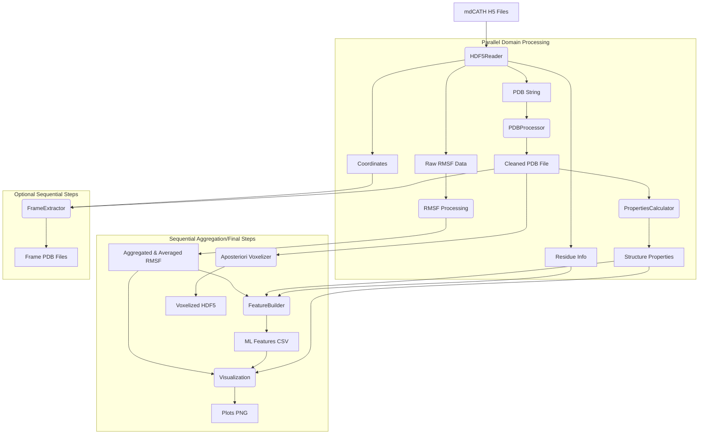

# 🧪 mdCATH Dataset Processor

[](https://opensource.org/licenses/MIT)
[](https://www.python.org/downloads/release/python-390/)

A comprehensive Python package for processing the mdCATH protein dynamics dataset. It extracts simulation data, cleans structures, calculates metrics and properties, builds ML-ready feature sets, performs voxelization, and generates high-quality visualizations.

---

## 📑 Table of Contents

<div style="display: grid; grid-template-columns: 1fr 1fr; grid-gap: 20px; margin-bottom: 30px;">
<div>

### Getting Started
- [🌟 Overview](#-overview)
- [🧬 About mdCATH Dataset](#-about-mdcath-dataset)
- [🔬 Key Features](#-key-features)
- [⚙️ Installation](#️-installation)
- [🚀 Quick Start](#-quick-start)

### Core Documentation
- [🔄 Dataflow Pipeline](#-dataflow-pipeline)
- [🛠️ Configuration Options](#️-configuration-options)
- [📊 Output Examples](#-output-examples)

</div>
<div>

### Technical Details
- [📂 Project Structure](#-project-structure)
- [🧩 Modules Explained](#-modules-explained)
- [🔮 Advanced Usage](#-advanced-usage)

### Resources
- [📚 API Reference (Key Components)](#-api-reference-key-components)
- [🐞 Troubleshooting](#-troubleshooting)
- [🤝 Contributing](#-contributing)
- [📜 License](#-license)

</div>
</div>

---

## 🌟 Overview

The mdCATH Dataset Processor is designed to transform raw molecular dynamics data from the mdCATH dataset into structured, analysis-ready formats optimized for machine learning applications. This pipeline extracts, processes, and organizes protein dynamics data, with a focus on Root Mean Square Fluctuation (RMSF) prediction.

By providing a consistent framework for data preparation, this project enables researchers to develop machine learning models that can accurately predict protein dynamics from structural features alone, potentially accelerating drug discovery and protein engineering efforts.

## 🧬 About mdCATH Dataset

The mdCATH dataset is a comprehensive collection of molecular dynamics simulations designed for data-driven computational biophysics research. Created by Antonio Mirarchi, Toni Giorgino, and Gianni De Fabritiis, this dataset provides:

- 🧪 Multiple temperature simulations (320K-450K likely, based on original)
- 🔄 Multiple replicas per temperature (check HDF5 files for specifics)
- ⏱️ Extensive trajectory data for protein domains from the CATH database
- 📊 Rich structural and dynamics information including coordinates, RMSF, and potentially DSSP data (though DSSP is calculated by this tool).

The original dataset is available on [Hugging Face](https://huggingface.co/datasets/compsciencelab/mdCATH) and can be visualized on [PlayMolecule](https://open.playmolecule.org/mdcath).

*Citation: Mirarchi, A., Giorgino, T., & De Fabritiis, G. (2024). mdCATH: A Large-Scale MD Dataset for Data-Driven Computational Biophysics. [arXiv:2407.14794](https://arxiv.org/abs/2407.14794)*

## 🔬 Key Features

- **Comprehensive Data Extraction**: Reads PDB, RMSF, coordinates, and residue info from mdCATH HDF5 files.
- **Sophisticated PDB Processing**: Cleans and standardizes PDB files using `pdbUtils` (recommended) or a fallback method.
- **Structural Property Calculation**: Computes DSSP secondary structure, SASA, Core/Exterior classification, and Phi/Psi angles using external `DSSP` and `BioPython`.
- **RMSF Analysis**: Extracts, validates, and averages RMSF data across replicas and temperatures.
- **ML-Ready Feature Generation**: Creates feature sets (CSV) combining RMSF, structural properties, and derived features (e.g., normalized position, encoded categories, log RMSF).
- **Insightful Visualizations**: Generates publication-quality plots (saved as PNG) summarizing data distributions, correlations, and pipeline results.
- **Voxelized Representation**: Converts cleaned protein structures to voxelized HDF5 format using `aposteriori`.
- **Frame Selection**: Extracts representative frames from trajectories using various methods (RMSD, regular, etc.) and saves them as PDB files.
- **Configurable & Parallelized**: Pipeline behavior controlled via YAML config, with support for parallel processing across CPU cores.

## ⚙️ Installation

### Prerequisites

- Python 3.9+
- **External Tools (Must be installed separately and available in PATH):**
    - `dssp` or `mkdssp`: For secondary structure calculation. (e.g., `conda install -c salilab dssp`)
    - `aposteriori`: For voxelization. (`pip install aposteriori`)
- **Core Python Dependencies (installed via pip):**
    - `h5py`, `numpy`, `pandas`, `scikit-learn`, `biopython`, `pdbUtils`, `PyYAML`, `tqdm`, `matplotlib`, `seaborn`, `statsmodels`

### Setup

1.  Clone the repository:
    ```bash
    git clone <repository-url> # Replace with your repo URL
    cd mdcath-processor
    ```

2.  Create and activate a virtual environment (recommended):
    ```bash
    python -m venv venv
    source venv/bin/activate  # On Windows use `venv\Scripts\activate`
    ```

3.  Install Python dependencies and the package itself:
    ```bash
    # Installs dependencies from pyproject.toml and makes the package runnable
    pip install -e .
    # OR for a non-editable install:
    # pip install .
    ```
    *(Note: This uses `pyproject.toml` and `setuptools`. `requirements.txt` lists the same dependencies for reference).*

4.  **Verify external tools installation:**
    ```bash
    # Make sure dssp/mkdssp and aposteriori (make-frame-dataset) are installed
    dssp --version # or mkdssp --version
    make-frame-dataset --help
    ```

5.  Verify Python environment and tool paths:
    ```bash
    python scripts/check_environment.py
    ```

## 🚀 Quick Start

### Basic CLI Usage

The pipeline is executed using the `mdprocess` command.

```bash
# Run processing using the default configuration (config/default_config.yaml)
mdprocess

# Process specific domains using a custom config file
mdprocess --config my_config.yaml --domains 12asA00 153lA00

# Override the output directory and number of cores
mdprocess --output-dir ./custom_outputs --num-cores 4

# Increase console logging verbosity (INFO)
mdprocess -v
# Increase console logging verbosity (DEBUG)
mdprocess -vv
```

### Example Python Workflow (Using the Executor)

While the `mdprocess` CLI is recommended, you can run the pipeline programmatically.

```python
import logging
from mdcath.config import load_config
from mdcath.pipeline.executor import PipelineExecutor, PipelineExecutionError
from mdcath.utils.logging_config import setup_logging

# Define the path to your configuration file
# config_path = 'path/to/your/config.yaml' # Optional: Defaults to 'config/default_config.yaml'
config_path = None # Use default

try:
    # Load configuration
    config = load_config(config_path)

    # Setup logging based on the loaded config
    # The executor also calls this, but setting up early can be useful
    setup_logging(config=config)

    # Override config settings if needed (optional)
    # config['input']['domain_ids'] = ['12asA00', '153lA00']
    # config['output']['base_dir'] = './custom_outputs_programmatic'
    # config['performance']['num_cores'] = 2

    # Initialize and run the pipeline executor
    executor = PipelineExecutor(config_dict=config)
    executor.run()

    logging.info("Pipeline execution finished successfully.")

except ConfigurationError as e:
    logging.error(f"Configuration error: {e}")
except PipelineExecutionError as e:
    logging.error(f"Pipeline execution error: {e}")
except Exception as e:
    logging.error(f"An unexpected error occurred: {e}", exc_info=True)

```

## 🔄 Dataflow Pipeline

The mdCATH processor transforms raw H5 data through a modular pipeline:



### Detailed Process Flow:

1.  **Domain Discovery**: Identifies target `domain_ids` from config or by scanning the `mdcath_folder`.
2.  **Parallel Domain Processing** (`PipelineExecutor` + `_parallel_domain_worker`):
    *   For each domain:
        *   **Data Extraction** (`HDF5Reader`): Reads PDB string, residue info, RMSF, and coordinates from the HDF5 file.
        *   **PDB Processing** (`PDBProcessor`): Cleans the PDB string using `pdbUtils` or fallback and saves `cleaned_pdb_path`.
        *   **Property Calculation** (`PropertiesCalculator`): Uses the cleaned PDB and external DSSP to calculate structural properties (DSSP, SASA, Core/Exterior, Phi/Psi) and stores `properties_result`.
        *   **RMSF Extraction** (`metrics.rmsf.process_domain_rmsf`): Reads, validates (length, NaNs), and aligns RMSF data with residue info for all temps/replicas, returning `rmsf_result`.
3.  **RMSF Aggregation & Averaging** (`metrics.rmsf.aggregate_and_average_rmsf`): Combines results from all successful domains to calculate replica-specific, temperature-specific replica averages, and overall temperature average RMSF dataframes. Results are saved to CSV (`io.writers`).
4.  **Feature Building** (`features.builder.FeatureBuilder`): Merges the averaged RMSF data and structural properties, calculates derived features (normalized position, encoded categories, log RMSF, etc.), and saves ML-ready datasets to CSV (`io.writers`).
5.  **Frame Extraction** (Optional, `structure.frame_extractor.extract_and_save_frames`): If configured (`num_frames > 0`), reads coordinates and uses methods like RMSD clustering to select and save representative frame PDB files. Runs sequentially after initial processing.
6.  **Voxelization** (Optional, `voxel.aposteriori_wrapper.run_aposteriori`): If enabled, calls the external `make-frame-dataset` tool on the cleaned PDB files to generate a voxelized HDF5 representation.
7.  **Visualization** (`visualize.plots`): Generates various summary plots (RMSF distributions, correlations, feature analysis, etc.) based on the aggregated data and saves them as PNG files.

## 🛠️ Configuration Options

The pipeline is configured via a YAML file (default: `config/default_config.yaml`). Key sections:

```yaml
# Default configuration for the mdCATH Processor pipeline

# Input Data Configuration
input:
  mdcath_folder: "/path/to/mdcath/data" # *** IMPORTANT: Set this path ***
  domain_ids: null   # List of specific domain IDs, or null/empty to process all found HDF5 files

# Output Configuration
output:
  base_dir: "./outputs" # Root directory for all generated files
  flatten_rmsf_dirs: true # Controls RMSF output structure

# Processing Parameters
processing:
  # Frame selection from simulation trajectories
  frame_selection:
    method: "rmsd"    # Options: 'regular', 'rmsd', 'gyration', 'random', 'last'
    num_frames: 0     # Number of frames to extract per domain/temperature/replica (0 = disable)
    cluster_method: "kmeans" # Method for RMSD-based selection

  # PDB Cleaning options
  pdb_cleaning:
    tool: "pdbutils" # Options: 'pdbutils', 'fallback'
    replace_chain_0_with_A: true
    fix_atom_numbering: true
    correct_unusual_residue_names: true # HSD/HSE/HSP -> HIS
    stop_after_ter: true
    remove_hydrogens: false
    remove_solvent_ions: true

  # Structure Properties Calculation (DSSP/SASA etc.)
  properties_calculation:
    dssp_executable: "dssp" # 'dssp' or 'mkdssp' (must be in PATH)
    fallback_method: "biopython" # Method if DSSP fails
    relative_asa_core_threshold: 0.20 # Relative ASA threshold for Core/Exterior

  # Feature Building options
  feature_building:
    add_rmsf_log: true # Add log-transformed RMSF column

  # Voxelization using Aposteriori
  voxelization:
    enabled: true # Set to false to skip
    aposteriori_executable: null # Path to 'make-frame-dataset' (if not in PATH)
    frame_edge_length: 12.0  # Angstroms
    voxels_per_side: 21
    atom_encoder: "CNOCBCA"
    encode_cb: true
    compression_gzip: true
    voxelise_all_states: false
    output_name: "mdcath_voxelized" # Base name for the output HDF5 file

# Performance Configuration
performance:
  num_cores: 0 # Parallel processes (0 uses os.cpu_count() - 2, 1 disables parallelism)
  batch_size: null # Optional: Batch size for memory-intensive steps (currently unused)

# Logging Configuration
logging:
  log_level_file: "DEBUG"    # Level for ./outputs/logs/pipeline.log
  log_level_console: "INFO"  # Level for console output
  log_filename: "pipeline.log"
  show_progress_bars: true

# Visualization Configuration
visualization:
  enabled: true # Set to false to skip plots
  dpi: 300      # Resolution for saved figures
  palette: "colorblind" # Seaborn color palette
  histogram_bins: 50    # Bins for histograms
```

## 📊 Output Examples

The processor generates structured outputs in the directory specified by `output.base_dir`.

### 1. RMSF Analysis Results

<table>
<tr><th colspan="4" style="text-align:left; background-color:#f0f7ff; padding:10px;">
<b>File:</b> <code>outputs/RMSF/replica_average/rmsf_all_temperatures_all_replicas.csv</code> (Example, actual cols depend on data)
</th></tr>
<tr style="background-color:#f8f9fa;">
<th>domain_id</th>
<th>resid</th>
<th>resname</th>
<th>rmsf_average</th>
<!-- Optional: rmsf_avg_at_320, rmsf_avg_at_348, ... columns might also be present depending on processing -->
</tr>
<tr>
<td>12asA00</td>
<td>1</td>
<td>MET</td>
<td><b>1.469</b></td>
</tr>
<tr style="background-color:#f8f9fa;">
<td>12asA00</td>
<td>2</td>
<td>LYS</td>
<td><b>1.291</b></td>
</tr>
<tr>
<td>12asA00</td>
<td>3</td>
<td>ILE</td>
<td><b>1.084</b></td>
</tr>
</table>
*   Individual replica RMSF files are stored under `outputs/RMSF/replicas/replica_X/` (if `flatten_rmsf_dirs` is false) or directly in `outputs/RMSF/replicas/` (if true).
*   Temperature-specific replica averages are under `outputs/RMSF/replica_average/`.

### 2. ML-Ready Feature Datasets

<table>
<tr><th colspan="19" style="text-align:left; background-color:#f0fff7; padding:10px;">
<b>File:</b> <code>outputs/ML_features/final_dataset_temperature_average.csv</code>
</th></tr>
<tr style="background-color:#f8f9fa; font-size:0.9em;">
<th>domain_id</th>
<th>resid</th>
<th>resname</th>
<th>rmsf_average</th>
<th>rmsf_log</th>
<th>protein_size</th>
<th>normalized_resid</th>
<th>chain</th>
<th>core_exterior</th>
<th>relative_accessibility</th>
<th>dssp</th>
<th>phi</th>
<th>psi</th>
<th>core_exterior_encoded</th>
<th>secondary_structure_encoded</th>
<th>resname_encoded</th>
<th>phi_norm</th>
<th>psi_norm</th>
</tr>
<tr>
<td>12asA00</td>
<td>1</td>
<td>MET</td>
<td>1.469</td>
<td>0.384</td>
<td>330</td>
<td>0.000</td>
<td>A</td>
<td>exterior</td>
<td>0.85</td>
<td>C</td>
<td>0.0</td>
<td>150.5</td>
<td>1</td>
<td>2</td>
<td>12</td>
<td>0.00</td>
<td>0.84</td>
</tr>
<tr style="background-color:#f8f9fa;">
<td>12asA00</td>
<td>2</td>
<td>LYS</td>
<td>1.291</td>
<td>0.255</td>
<td>330</td>
<td>0.003</td>
<td>A</td>
<td>exterior</td>
<td>0.63</td>
<td>T</td>
<td>-75.2</td>
<td>160.1</td>
<td>1</td>
<td>2</td>
<td>11</td>
<td>-0.42</td>
<td>0.89</td>
</tr>
<tr>
<td>12asA00</td>
<td>3</td>
<td>ILE</td>
<td>1.084</td>
<td>0.081</td>
<td>330</td>
<td>0.006</td>
<td>A</td>
<td>core</td>
<td>0.15</td>
<td>E</td>
<td>-135.8</td>
<td>140.3</td>
<td>0</td>
<td>1</td>
<td>8</td>
<td>-0.75</td>
<td>0.78</td>
</tr>
</table>

<table>
<tr><th colspan="2" style="text-align:left; background-color:#f0fff7; padding:10px;">
<b>Feature Descriptions</b>
</th></tr>
<tr>
<th style="width:30%;">Feature</th>
<th style="width:70%;">Description</th>
</tr>
<tr style="background-color:#f8f9fa;">
<td><code>rmsf_average</code></td>
<td>Average RMSF across all temperatures/replicas</td>
</tr>
<tr>
<td><code>rmsf_log</code></td>
<td>Natural log of `rmsf_average` (or temperature-specific RMSF in other files)</td>
</tr>
<tr style="background-color:#f8f9fa;">
<td><code>protein_size</code></td>
<td>Total number of unique residues in the domain</td>
</tr>
<tr>
<td><code>normalized_resid</code></td>
<td>Residue position scaled from 0 (N-term) to 1 (C-term)</td>
</tr>
<tr style="background-color:#f8f9fa;">
<td><code>chain</code></td>
<td>Chain identifier</td>
</tr>
<tr>
<td><code>core_exterior</code></td>
<td>Classification based on accessibility ('core' or 'exterior')</td>
</tr>
<tr style="background-color:#f8f9fa;">
<td><code>relative_accessibility</code></td>
<td>Calculated relative solvent accessibility (0-1)</td>
</tr>
<tr>
<td><code>dssp</code></td>
<td>DSSP secondary structure assignment code (e.g., H, E, C, T, S)</td>
</tr>
<tr style="background-color:#f8f9fa;">
<td><code>phi</code>, <code>psi</code></td>
<td>Backbone torsion angles (degrees) from DSSP</td>
</tr>
<tr>
<td><code>*_encoded</code> columns</td>
<td>Numerical encodings (0, 1, 2...) for categorical features (core/exterior, SS type, resname)</td>
</tr>
<tr style="background-color:#f8f9fa;">
<td><code>phi_norm</code>, <code>psi_norm</code></td>
<td>Normalized torsion angles (-1 to 1)</td>
</tr>
</table>
*   Temperature-specific feature files (e.g., `final_dataset_temperature_320.csv`) are also generated.

### 3. PDB Files (Cleaned and Frames)

<table>
<tr><th colspan="2" style="text-align:left; background-color:#fff7f0; padding:10px;">
<b>Cleaned PDB File:</b> <code>outputs/pdbs/12asA00.pdb</code>
</th></tr>
<tr>
<td style="font-family:monospace; white-space:pre; background-color:#f8f9fa; padding:10px; font-size:0.9em;">
CRYST1    1.000    1.000    1.000  90.00  90.00  90.00 P 1           1
ATOM      1  N   MET A   1      -9.152  25.423   4.759  1.00  0.00           N
ATOM      2  CA  MET A   1      -9.446  24.674   3.532  1.00  0.00           C
ATOM      3  C   MET A   1      -8.188  24.560   2.681  1.00  0.00           C
ATOM      4  O   MET A   1      -7.506  25.552   2.424  1.00  0.00           O
ATOM      5  CB  MET A   1     -10.523  25.351   2.701  1.00  0.00           C
...
ATOM    XXX TER  XXX A XXX     ...
END
</td>
</tr>
</table>

<table>
<tr><th colspan="2" style="text-align:left; background-color:#fff7f0; padding:10px;">
<b>Frame File:</b> <code>outputs/frames/320/replica_0/12asA00_frame_10.pdb</code> (Example path/frame index)
</th></tr>
<tr>
<td style="font-family:monospace; white-space:pre; background-color:#f8f9fa; padding:10px; font-size:0.9em;">
CRYST1    1.000    1.000    1.000  90.00  90.00  90.00 P 1           1
ATOM      1  N   MET A   1      91.234  45.677  59.421  1.00  0.00           N
ATOM      2  CA  MET A   1      91.786  44.892  58.342  1.00  0.00           C
...
</td>
</tr>
</table>

### 4. Voxelized Data

*   **File:** `outputs/voxelized/mdcath_voxelized.hdf5` (or name specified in config)
*   **Content:** HDF5 file containing voxelized representations of the cleaned PDB structures, formatted according to the `aposteriori` tool's output specification. Suitable for 3D deep learning models.

### 5. Visualizations

Multiple plots are generated in `outputs/visualizations/` providing insights into the processed data. Examples include:
*   `temperature_summary_heatmap.png`: Mean RMSF across domains and temperatures.
*   `rmsf_violin_plot.png`: RMSF distributions per temperature.
*   `rmsf_histogram_separated.png`: Individual histograms of RMSF per temperature and overall average.
*   `amino_acid_rmsf_colored.png`: RMSF distributions per amino acid type, colored by property.
*   `replica_variance_plot.png`: Analysis of RMSF variance between replicas.
*   `dssp_rmsf_correlation_plot.png`: Correlation between secondary structure and RMSF.
*   `feature_correlation_plot.png`: Heatmap of correlations between ML features.
*   `ml_features_analysis.png` & `ml_features_additional_analysis.png`: Scatter plots and distributions exploring relationships between features.
*   `pipeline_summary_report.png`: A dashboard summarizing processing status and key data distributions.
*   `voxelization_info.png`: Summary of voxelization parameters and output file info.
*   `rmsf_density_plots.png`: 2D density plots of RMSF vs accessibility/position.
*   `rmsf_density_by_aa_ss.png`: Ridgeline plot of RMSF density for top AAs separated by SS type.

*(Specific filenames and appearances may vary slightly)*

## 📂 Project Structure

```
mdcath-processor/
├── config/
│   └── default_config.yaml     # Default pipeline configuration
├── scripts/
│   └── check_environment.py    # Script to check external tools
├── src/
│   └── mdcath/                 # Main package source code
│       ├── cli.py              # Command-line interface logic
│       ├── config.py           # Configuration loading/validation
│       ├── exceptions.py       # Custom exception classes
│       ├── features/           # ML Feature Building
│       │   └── builder.py
│       ├── io/                 # Input/Output handling
│       │   ├── hdf5_reader.py  # Reads mdCATH HDF5 files
│       │   └── writers.py      # Writes CSV, PDB files
│       ├── metrics/            # Calculation of metrics (RMSF)
│       │   └── rmsf.py
│       ├── pipeline/           # Pipeline orchestration
│       │   └── executor.py     # Main pipeline execution class
│       ├── structure/          # Protein structure processing
│       │   ├── frame_extractor.py # Extracts frames from coordinates
│       │   ├── pdb_processor.py   # Cleans PDB files
│       │   └── properties.py    # Calculates DSSP, SASA, etc.
│       ├── utils/              # Utility functions
│       │   ├── logging_config.py # Logging setup
│       │   └── parallel.py     # Parallel processing helper
│       ├── visualize/          # Visualization generation
│       │   └── plots.py
│       └── voxel/              # Voxelization handling
│           └── aposteriori_wrapper.py # Runs external voxelizer
├── tests/                      # Unit and integration tests (structure shown in AI_context)
├── main.py                     # Main script entry point (calls cli.main)
├── LICENSE                     # MIT License
├── pyproject.toml              # Build system configuration and dependencies
├── README.md                   # This documentation
└── requirements.txt            # Dependency list (for reference)
```

*(Directory `outputs/` is generated upon running the pipeline)*

## 🧩 Modules Explained

*   **`mdcath.cli`**: Handles command-line argument parsing (`argparse`) and initiates the pipeline.
*   **`mdcath.config`**: Loads and validates the `config.yaml` file.
*   **`mdcath.pipeline.executor`**: Orchestrates the entire processing workflow, manages parallel execution, and calls other modules. Contains the main `PipelineExecutor` class.
*   **`mdcath.io.hdf5_reader`**: `HDF5Reader` class specifically designed to read data (PDB, RMSF, coords, residue info) from the mdCATH HDF5 file format.
*   **`mdcath.io.writers`**: Helper functions to save DataFrames (CSV) and strings (PDB) to files, handling directory creation.
*   **`mdcath.structure.pdb_processor`**: `PDBProcessor` class cleans PDB structures using `pdbUtils` or a fallback, based on configuration.
*   **`mdcath.structure.properties`**: `PropertiesCalculator` class calculates DSSP, SASA, core/exterior classification, and torsion angles, using `BioPython` and an external DSSP executable.
*   **`mdcath.structure.frame_extractor`**: Functions to select and extract specific frames from coordinate trajectories based on configured methods (RMSD, regular, etc.).
*   **`mdcath.metrics.rmsf`**: Functions to process RMSF data per domain (`process_domain_rmsf`), aggregate results across domains, and calculate replica/temperature averages (`aggregate_and_average_rmsf`).
*   **`mdcath.features.builder`**: `FeatureBuilder` class combines RMSF and structural properties, performs validation, calculates derived features (normalized position, encodings), and creates the final ML-ready DataFrames.
*   **`mdcath.voxel.aposteriori_wrapper`**: Function (`run_aposteriori`) to execute the external `make-frame-dataset` command for voxelization.
*   **`mdcath.visualize.plots`**: Contains various functions (`create_*_plot`) that generate `matplotlib`/`seaborn` plots from the processed data.
*   **`mdcath.utils.logging_config`**: Sets up file and console logging handlers and formatting.
*   **`mdcath.utils.parallel`**: Provides the `parallel_map` function using `concurrent.futures.ProcessPoolExecutor` for parallelization.
*   **`mdcath.exceptions`**: Defines custom exception classes for specific error handling throughout the package.

## 🔮 Advanced Usage

### Customizing the Pipeline Programmatically

While the `PipelineExecutor` handles the standard workflow, you can import and use individual components for custom analysis.

```python
import pandas as pd
from mdcath.config import load_config
from mdcath.io.hdf5_reader import HDF5Reader
from mdcath.structure.pdb_processor import PDBProcessor
from mdcath.structure.properties import PropertiesCalculator
from mdcath.metrics.rmsf import process_domain_rmsf

# Load config
config = load_config() # Loads default config
pdb_cleaning_config = config.get('processing', {}).get('pdb_cleaning', {})
prop_calc_config = config.get('processing', {}).get('properties_calculation', {})

# Initialize components
pdb_processor = PDBProcessor(pdb_cleaning_config)
prop_calculator = PropertiesCalculator(prop_calc_config)

# Process a single domain manually
domain_id = '12asA00'
h5_path = f"{config['input']['mdcath_folder']}/mdcath_dataset_{domain_id}.h5"
output_dir = config['output']['base_dir']
pdb_out_path = f"{output_dir}/pdbs/{domain_id}.pdb"

try:
    reader = HDF5Reader(h5_path)
    pdb_string = reader.get_pdb_string()
    if pdb_string and pdb_processor.clean_pdb_string(pdb_string, pdb_out_path):
        properties = prop_calculator.calculate_properties(pdb_out_path)
        rmsf_results_tuple = process_domain_rmsf(domain_id, reader, config)

        if properties is not None:
            print(f"Properties for {domain_id}:\n{properties.head()}")
        if rmsf_results_tuple:
            res_info, rmsf_data = rmsf_results_tuple
            print(f"RMSF data collected for {len(rmsf_data)} temps for {domain_id}")

except Exception as e:
    print(f"Error processing domain {domain_id}: {e}")

```

### Using Extracted Features for Machine Learning

```python
import pandas as pd
from sklearn.ensemble import RandomForestRegressor
from sklearn.model_selection import train_test_split
from sklearn.metrics import mean_squared_error

# Load the feature dataset (adjust path if needed)
features_df = pd.read_csv("outputs/ML_features/final_dataset_temperature_average.csv")
features_df.dropna(subset=['rmsf_average'], inplace=True) # Ensure target is not NaN

# Select features and target
# Choose features based on analysis (e.g., correlation plots)
feature_cols = ['normalized_resid', 'relative_accessibility',
                'secondary_structure_encoded', 'core_exterior_encoded',
                'resname_encoded', 'phi_norm', 'psi_norm', 'protein_size']
target_col = 'rmsf_average'

# Ensure selected feature columns exist and handle potential NaNs in features
X = features_df[[col for col in feature_cols if col in features_df.columns]].copy()
X.fillna(X.mean(), inplace=True) # Example: fill NaNs with mean (consider other strategies)
y = features_df[target_col]

# Split data
X_train, X_test, y_train, y_test = train_test_split(X, y, test_size=0.2, random_state=42)

# Train a model
model = RandomForestRegressor(n_estimators=100, random_state=42, n_jobs=-1) # Use multiple cores
model.fit(X_train, y_train)

# Evaluate
y_pred = model.predict(X_test)
rmse = mean_squared_error(y_test, y_pred, squared=False)
print(f"RMSE on test set: {rmse:.4f}")

# Feature importance
importance = pd.DataFrame({
    'Feature': X.columns,
    'Importance': model.feature_importances_
}).sort_values('Importance', ascending=False)
print("\nFeature Importance:")
print(importance)
```

### Using Voxelized Data with PyTorch

```python
import h5py
import torch
import torch.nn as nn
import torch.nn.functional as F

# Load voxelized data (adjust path/name if needed)
voxel_file = "outputs/voxelized/mdcath_voxelized.hdf5"

try:
    with h5py.File(voxel_file, 'r') as f:
        # Aposteriori format: domain_id / chain_id / residue_id / frame_id / data
        # Example: Accessing voxel data for the first residue of the first frame of chain A for domain 1abc
        # This structure might vary, inspect the HDF5 file!
        example_domain = list(f.keys())[0]
        example_chain = list(f[example_domain].keys())[0]
        example_residue = list(f[f'{example_domain}/{example_chain}'].keys())[0]
        example_frame = list(f[f'{example_domain}/{example_chain}/{example_residue}'].keys())[0]

        # Voxel data shape depends on aposteriori settings (atom_encoder, etc.)
        # Shape is typically (channels, voxels_x, voxels_y, voxels_z)
        voxels = torch.tensor(f[f'{example_domain}/{example_chain}/{example_residue}/{example_frame}/voxels'][:])
        print(f"Loaded voxel data shape: {voxels.shape}") # e.g., torch.Size([6, 21, 21, 21]) for CNOCBCA

except FileNotFoundError:
    print(f"Voxel file not found: {voxel_file}")
except Exception as e:
    print(f"Error reading voxel file: {e}")

# Simple 3D CNN example (adapt architecture as needed)
# Assumes 6 input channels for 'CNOCBCA' encoder
class Voxel3DCNN(nn.Module):
    def __init__(self, in_channels=6, grid_size=21, output_dim=1):
        super().__init__()
        # Example layers - adjust kernel sizes, padding, channels based on grid_size
        final_conv_size = grid_size // 4 # After two MaxPool3d(2)
        self.conv1 = nn.Conv3d(in_channels, 32, kernel_size=3, padding=1)
        self.pool = nn.MaxPool3d(2)
        self.conv2 = nn.Conv3d(32, 64, kernel_size=3, padding=1)
        # Calculate flattened size carefully
        self.fc1 = nn.Linear(64 * final_conv_size**3, 128)
        self.fc2 = nn.Linear(128, output_dim) # Predict RMSF or other properties

    def forward(self, x):
        # Add batch dimension if needed: x = x.unsqueeze(0)
        x = self.pool(F.relu(self.conv1(x)))
        x = self.pool(F.relu(self.conv2(x)))
        x = torch.flatten(x, 1) # Flatten all dimensions except batch
        x = F.relu(self.fc1(x))
        x = self.fc2(x)
        return x

# model = Voxel3DCNN()
# print(model)
```

## 📚 API Reference (Key Components)

This package is primarily intended for use via the `mdprocess` CLI and the `PipelineExecutor` class. Direct interaction with lower-level modules is possible for advanced customization but requires understanding the internal data flow.

Key classes and functions:

*   **`mdcath.pipeline.executor.PipelineExecutor(config_dict)`**: Main class to run the full pipeline. `executor.run()`.
*   **`mdcath.config.load_config(config_path=None)`**: Loads and validates the YAML configuration.
*   **`mdcath.io.hdf5_reader.HDF5Reader(h5_path)`**: Reads data from a single HDF5 file. Methods: `get_pdb_string()`, `get_residue_info()`, `get_rmsf()`, `get_coordinates()`, `get_scalar_traj()`.
*   **`mdcath.structure.pdb_processor.PDBProcessor(config)`**: Cleans PDB files/strings. Method: `clean_pdb_string()`, `clean_pdb_file()`.
*   **`mdcath.structure.properties.PropertiesCalculator(config)`**: Calculates structural properties. Method: `calculate_properties()`.
*   **`mdcath.metrics.rmsf.*`**: Functions like `process_domain_rmsf`, `aggregate_and_average_rmsf`.
*   **`mdcath.features.builder.FeatureBuilder(...)`**: Builds feature DataFrames. Method: `build_features()`.
*   **`mdcath.visualize.plots.*`**: Functions to create specific plots (e.g., `create_rmsf_distribution_plots`).
*   **`mdcath.voxel.aposteriori_wrapper.run_aposteriori(...)`**: Executes the external voxelizer.

## 🐞 Troubleshooting

### Common Issues

*   **`ConfigurationError: Configuration file not found...`**: Ensure `config/default_config.yaml` exists or provide a valid path using `--config`.
*   **`ConfigurationError: 'input.mdcath_folder' (...) is not specified...`**: Set the correct path to the mdCATH HDF5 dataset directory in your `config.yaml`.
*   **`FileNotFoundError: [Errno 2] No such file or directory: 'dssp'` (or `mkdssp`)**: The DSSP executable is not installed or not found in your system's PATH. Install it (e.g., via conda) and ensure the PATH is configured correctly. Run `scripts/check_environment.py` to verify.
*   **`FileNotFoundError: [Errno 2] No such file or directory: 'make-frame-dataset'`**: The `aposteriori` tool is not installed or not found in your PATH. Install it (`pip install aposteriori`). Run `scripts/check_environment.py`.
*   **`HDF5ReaderError: Domain ID group '...' not found...`**: Check if the domain ID in the filename matches the group name inside the HDF5 file. Ensure the HDF5 file is not corrupted.
*   **`Residue mismatch for domain ...`**: The number of residues found in the HDF5 `resid`/`resname` datasets does not match the number of residues found in the derived structural properties (often due to PDB cleaning issues or inconsistencies in the source HDF5). The pipeline skips merging for this domain. Check logs for details.
*   **`VoxelizationError: Aposteriori command failed...`**: The `make-frame-dataset` command failed. Check the detailed `STDOUT` and `STDERR` logs printed just before the error message in `outputs/logs/pipeline.log` for clues from the aposteriori tool itself. Common reasons include issues parsing input PDBs or invalid parameters.
*   **`MemoryError` or Slow Performance**: Processing large datasets can be memory/CPU intensive.
    *   Ensure `performance.num_cores` is set appropriately for your system.
    *   Process fewer domains at a time using the `--domains` argument if needed.
    *   Monitor system resource usage.

### Debugging Tips

1.  **Increase Log Verbosity**: Run `mdprocess -vv` to get DEBUG level messages in the console.
2.  **Check Log File**: Examine `outputs/logs/pipeline.log` (or the filename set in config) for detailed error messages and tracebacks.
3.  **Run Environment Check**: Execute `python scripts/check_environment.py` to verify external tools.
4.  **Process a Single Domain**: Test with one known-good domain first: `mdprocess --domains 12asA00 --output ./test_output -vv` (replace `12asA00` with a valid domain).
5.  **Examine Intermediate Files**: Check the contents of `outputs/pdbs/`, `outputs/RMSF/`, etc., to see where the pipeline might be failing.

## 🤝 Contributing

Contributions are welcome! Please follow standard GitHub practices:

1.  Fork the repository.
2.  Create a feature branch (`git checkout -b feature/my-new-feature`).
3.  Make your changes.
4.  Add tests for new functionality if applicable.
5.  Ensure code follows style guidelines (e.g., consider using `black` for formatting).
6.  Commit your changes (`git commit -am 'Add some feature'`).
7.  Push to the branch (`git push origin feature/my-new-feature`).
8.  Open a Pull Request.

## 📜 License

This project is licensed under the MIT License - see the [LICENSE](LICENSE) file for details.

```
MIT License

Copyright (c) 2024 [Your Name or Organization] # Update Year/Name

Permission is hereby granted, free of charge, to any person obtaining a copy
of this software and associated documentation files (the "Software"), to deal
in the Software without restriction, including without limitation the rights
to use, copy, modify, merge, publish, distribute, sublicense, and/or sell
copies of the Software, and to permit persons to whom the Software is
furnished to do so, subject to the following conditions:

The above copyright notice and this permission notice shall be included in all
copies or substantial portions of the Software.

THE SOFTWARE IS PROVIDED "AS IS", WITHOUT WARRANTY OF ANY KIND, EXPRESS OR
IMPLIED, INCLUDING BUT NOT LIMITED TO THE WARRANTIES OF MERCHANTABILITY,
FITNESS FOR A PARTICULAR PURPOSE AND NONINFRINGEMENT. IN NO EVENT SHALL THE
AUTHORS OR COPYRIGHT HOLDERS BE LIABLE FOR ANY CLAIM, DAMAGES OR OTHER
LIABILITY, WHETHER IN AN ACTION OF CONTRACT, TORT OR OTHERWISE, ARISING FROM,
OUT OF OR IN CONNECTION WITH THE SOFTWARE OR THE USE OR OTHER DEALINGS IN THE
SOFTWARE.
```

---

<p align="center">
  <a href="#"> <!-- Add Link to your Repo -->
    
  </a>
</p>

<p align="center">
  <em>Developed with ❤️ for the scientific community.</em>
</p>