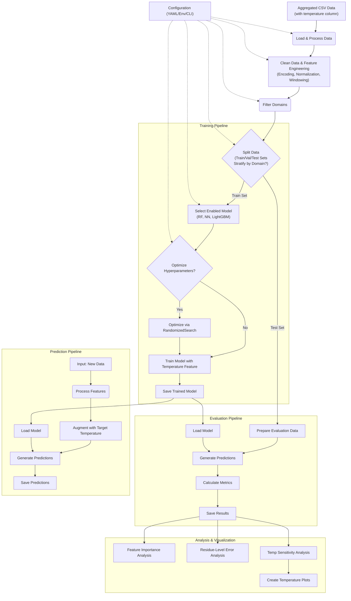

# EnsembleFlex: Temperature-Aware Protein Flexibility ML Pipeline 🧬🌡️

<div align="center">


[](https://www.python.org/)
[](LICENSE)
[](CONTRIBUTING.md)
[](https://github.com/your-github-username/EnsembleFlex)

**A unified machine learning approach for predicting protein flexibility (RMSF) with temperature awareness using protein sequence and structural features.**

[📊 Key Features](#-key-features) •
[🔧 Installation](#-installation) •
[🚀 Quick Start](#-quick-start) •
[🔄 Pipeline Overview](#-pipeline-overview) •
[📥 Input Data](#-input-data) •
[📤 Output Data](#-output-data) •
[🤖 Models](#-models) •
[📈 Analysis](#-analysis) •
[⚙️ Configuration](#-configuration) •
[💻 Command-Line Interface](#-command-line-interface) •
[📚 Citation](#-citation)

</div>

## 🌟 Overview

EnsembleFlex is a refactored machine learning pipeline designed for predicting protein flexibility, quantified as Root Mean Square Fluctuation (RMSF), based on protein sequence and structural features. Unlike previous approaches that train separate models for each temperature, EnsembleFlex introduces a **unified, temperature-aware model trained on aggregated data across multiple temperatures**.

The pipeline offers two distinct operational modes, configurable via the `mode.active` setting:

- **🔬 Standard Mode**: Utilizes a rich set of features derived directly from protein sequence and basic structural properties (e.g., protein size, residue position, solvent accessibility, secondary structure classification, backbone dihedral angles).
  
- **🔭 OmniFlex Mode**: An enhanced prediction mode that leverages the standard features *plus* pre-computed RMSF predictions derived from external, powerful models like ESM (Evolutionary Scale Modeling) embeddings (`esm_rmsf`) and 3D voxel representations (`voxel_rmsf`), aiming for improved predictive accuracy.

EnsembleFlex employs a modular architecture built upon Python libraries like Pandas, Scikit-learn, PyTorch, and LightGBM. By using temperature as an explicit input feature, the model learns temperature-dependent dynamics from a single training process, improving efficiency and enabling predictions at arbitrary temperatures.

## 📊 Key Features

<table>
<thead>
  <tr bgcolor="#6236FF">
    <th width="200"><span style="color:white">Feature</span></th>
    <th><span style="color:white">Description</span></th>
  </tr>
</thead>
<tbody>
  <tr>
    <td>🌡️ <b>Temperature-Aware Modeling</b></td>
    <td>Trains a single unified model that uses temperature as an explicit input feature, enabling predictions at any temperature within the training range.</td>
  </tr>
  <tr>
    <td>🤖 <b>Multiple ML Models</b></td>
    <td>Supports Random Forest, Neural Network, and LightGBM implementations. Easily extendable architecture via the BaseModel class.</td>
  </tr>
  <tr>
    <td>⚙️ <b>Feature Engineering</b></td>
    <td>Automatic encoding of categorical features, normalization of angles, calculation of normalized residue position, and optional window-based features for context-aware predictions.</td>
  </tr>
  <tr>
    <td>🔬 <b>OmniFlex Mode</b></td>
    <td>Enhanced prediction by incorporating external model outputs (ESM embeddings, 3D voxel data) as input features.</td>
  </tr>
  <tr>
    <td>⚠️ <b>Uncertainty Quantification</b></td>
    <td>Models provide uncertainty estimates: standard deviation across trees for Random Forest, Monte Carlo Dropout for Neural Network.</td>
  </tr>
  <tr>
    <td>📏 <b>Comprehensive Evaluation</b></td>
    <td>Multiple metrics including RMSE, MAE, R², Pearson correlation, and Spearman correlation. All metrics are configurable.</td>
  </tr>
  <tr>
    <td>📊 <b>Temperature Analysis</b></td>
    <td>Tools for analyzing model sensitivity to temperature input, showing how predictions change across temperature ranges.</td>
  </tr>
  <tr>
    <td>🧩 <b>Domain Stratification</b></td>
    <td>Data splitting that ensures all residues from the same protein domain stay in the same split, preventing data leakage.</td>
  </tr>
  <tr>
    <td>🎯 <b>Hyperparameter Optimization</b></td>
    <td>Automated tuning for all models using RandomizedSearchCV for Random Forest and LightGBM.</td>
  </tr>
  <tr>
    <td>💻 <b>Command-Line Interface</b></td>
    <td>User-friendly CLI powered by Click, with commands for training, evaluation, prediction, and temperature comparison.</td>
  </tr>
  <tr>
    <td>⚙️ <b>Flexible Configuration</b></td>
    <td>Comprehensive configuration via YAML, environment variables, and CLI parameter overrides.</td>
  </tr>
</tbody>
</table>

## 🔧 Installation

### Prerequisites
- Python 3.8 or higher
- pip (Python package installer)

### Install from Source
```bash
# 1. Clone the repository
git clone https://github.com/your-github-username/EnsembleFlex.git
cd EnsembleFlex

# 2. Install the package in editable mode
pip install -e .
```

### Dependencies
Core dependencies are managed by `setuptools` via `pyproject.toml`. Key dependencies include:
`numpy`, `pandas`, `scikit-learn`, `torch`, `lightgbm`, `pyyaml`, `click`, `matplotlib`, `seaborn`, `joblib`, `tqdm`, `optuna`.

## 🚀 Quick Start

### Data Preparation
EnsembleFlex expects a single aggregated CSV file containing data from multiple temperatures, with temperature as an explicit input feature:

```bash
# Convert separate temperature files to a single aggregated dataset
python scripts/aggregate_data.py --input-dir ./data --output-file ./data/aggregated_train_dataset.csv
```

### Basic Usage
```bash
# Train a Random Forest model using default config
ensembleflex train --model random_forest

# Evaluate the trained Random Forest model
ensembleflex evaluate --model random_forest
# Check output in ./output/ensembleflex/evaluation_results.csv

# Make predictions for new proteins at a specific temperature
ensembleflex predict --input ./data/new_proteins.csv --temperature 348.5 --model random_forest
```

### Advanced Usage
```bash
# Train a Neural Network using OmniFlex mode
ensembleflex train --mode omniflex --model neural_network

# Run the full pipeline (train, evaluate, analyze)
ensembleflex run --model lightgbm

# Compare model predictions across a temperature range
ensembleflex compare-temperatures --model random_forest --input ./data/test_data.csv --temp-range 320,450,10
```

## 🔄 Pipeline Overview

EnsembleFlex follows a structured workflow managed by the `Pipeline` class, driven by configuration settings.

**Conceptual Workflow:**



## 📥 Input Data

EnsembleFlex expects a **single aggregated CSV file** containing data from multiple temperatures. This is a key difference from previous approaches that used separate files for each temperature.

### Expected Columns

| Column Name                 | Type    | Description                                                  | Required? |
|-----------------------------|---------|--------------------------------------------------------------|-----------|
| domain_id                   | string  | Protein domain identifier (e.g., '1a0aA00')                  | Yes       |
| resid                       | int     | Residue ID (position in the original chain)                  | Yes       |
| resname                     | string  | 3-letter amino acid code (e.g., 'ALA', 'LYS')                | Yes       |
| protein_size                | int     | Total number of residues in the protein/domain               | No        |
| normalized_resid            | float   | Residue position normalized to [0, 1] range                  | No        |
| core_exterior               | string  | Original classification ('core' or 'surface')                | No        |
| relative_accessibility      | float   | Solvent Accessible Surface Area (SASA), typically [0, 1]     | No        |
| dssp                        | string  | Secondary structure char (DSSP: H, E, C, T, G, etc.)         | No        |
| phi                         | float   | Backbone dihedral angle phi (degrees)                        | No        |
| psi                         | float   | Backbone dihedral angle psi (degrees)                        | No        |
| temperature                 | float   | **INPUT FEATURE:** Temperature (K) for this data point       | Yes       |
| rmsf                        | float   | **TARGET:** RMSF value for this residue at 'temperature'     | Yes       |
| esm_rmsf (OmniFlex only)    | float   | External prediction from ESM embeddings                      | For OmniFlex mode |
| voxel_rmsf (OmniFlex only)  | float   | External prediction from 3D voxel representation             | For OmniFlex mode |
| bfactor_norm                | float   | Normalized B-factor                                          | No        |

*Missing optional columns will be generated if possible during data processing, or filled with default values. The pipeline will derive features like `resname_encoded`, `core_exterior_encoded`, etc., from source columns.*

## 📤 Output Data

Output files are saved to the configured output directory (default: `./output/ensembleflex/`).

| Output Type                 | Description                                             | Format | Default Path                                      |
| :-------------------------- | :------------------------------------------------------ | :----- | :------------------------------------------------ |
| 💾 **Trained Models**       | Saved state of trained models                           | `.pkl`/`.pt` | `./models/ensembleflex/{model_name}.pkl`            |
| 📊 **Evaluation Metrics**   | Summary of performance metrics for the model            | CSV    | `./output/ensembleflex/evaluation_results.csv`   |
| 📈 **Detailed Results**     | Full dataset with predictions, errors, and uncertainty  | CSV    | `./output/ensembleflex/all_results.csv`          |
| 🧩 **Domain Metrics**       | Performance metrics aggregated per domain               | CSV    | `./output/ensembleflex/domain_analysis/domain_metrics.csv` |
| 🔮 **Predictions**          | Predictions on new input data at specified temperatures | CSV    | `./output/ensembleflex/{input_base}_predictions.csv` |
| ⭐ **Feature Importance**   | Importance scores for each feature per model            | CSV, PNG| `./output/ensembleflex/feature_importance/`      |
| 🧬 **Residue Analysis**     | Data for error analysis by AA, position, structure      | CSV, PNG| `./output/ensembleflex/residue_analysis/`        |
| 🌡️ **Temperature Analysis** | Analysis of model predictions vs temperature            | CSV, PNG| `./output/ensembleflex/temperature_analysis/`    |
| 📉 **Training History (NN)**| Epoch-wise loss/metrics for Neural Network              | CSV, PNG| `./output/ensembleflex/training_performance/`    |

## 🤖 Models

EnsembleFlex implements multiple model types, all configurable in the `models` section of the config YAML.

| Model             | Implementation        | Key Config Parameters                                | Uncertainty Method               | Hyperparameter Optimization      |
| :---------------- | :-------------------- | :--------------------------------------------------- | :------------------------------- | :------------------------------- |
| 🌲 **Random Forest** | `RandomForestModel`   | `n_estimators`, `max_depth`, `min_samples_split`      | Variance across tree predictions | RandomizedSearchCV               |
| 🧠 **Neural Network**| `NeuralNetworkModel`  | `hidden_layers`, `activation`, `dropout`, `optimizer` | Monte Carlo Dropout sampling     | Custom (early stopping, manual)  |
| 🚀 **LightGBM**      | `LightGBMModel`       | `n_estimators`, `learning_rate`, `num_leaves`         | Not currently implemented        | RandomizedSearchCV (optional)    |

All models inherit from the `BaseModel` class, ensuring a consistent interface and making it easy to add new model types.

## 📈 Analysis

EnsembleFlex provides several analysis tools to understand model performance and feature importance:

### Feature Importance

Analyzes which features most strongly influence predictions, with special attention to the temperature feature's importance.

```bash
# Train a model and analyze feature importance
ensembleflex train --model random_forest
ensembleflex run --model random_forest
# Check results in ./output/ensembleflex/feature_importance/
```

### Residue-Level Error Analysis

Examines prediction errors by amino acid type, secondary structure, sequence position, and solvent exposure.

```bash
# Run residue-level error analysis
ensembleflex run --model lightgbm
# Check results in ./output/ensembleflex/residue_analysis/
```

### Temperature Sensitivity Analysis

Analyzes how predictions change with temperature, crucial for understanding the model's temperature awareness.

```bash
# Compare predictions across a temperature range
ensembleflex compare-temperatures --model neural_network --input test_data.csv --temp-range 320,450,10
# Check results in ./output/ensembleflex/temperature_analysis/
```

## ⚙️ Configuration

EnsembleFlex uses a comprehensive configuration system with YAML files, environment variables, and CLI parameter overrides.

### Configuration Sources (highest to lowest precedence)
1. **CLI Parameter Overrides**: `--param models.random_forest.n_estimators=200`
2. **Environment Variables**: `ENSEMBLEFLEX_MODELS_RANDOM_FOREST_N_ESTIMATORS=200`
3. **User Config File**: `--config my_config.yaml`
4. **Default Config**: `default_config.yaml` (packaged with the library)

### Example Configuration

```yaml
# ensembleflex Configuration

# Paths (Generalized - No temperature templating needed)
paths:
  data_dir: ./data               # Data directory
  output_dir: ./output/ensembleflex/  # Unified output directory for this model
  models_dir: ./models/ensembleflex/  # Unified models directory for this model

# Mode configuration
mode:
  active: "omniflex"              # "standard" or "omniflex"
  omniflex:
    use_esm: true                 # Use ESM embeddings feature
    use_voxel: true               # Enable 3D voxel feature

# Temperature configuration (Simplified)
temperature:
  available: [320, 348, 379, 413, 450] # INFORMATIONAL ONLY - List of temps in original data
  comparison:
    enabled: true                 # Analyze sensitivity to input temperature
    metrics: ["rmse", "r2", "pearson_correlation"]

# Dataset configuration (Updated for aggregated data)
dataset:
  # Data loading
  file_pattern: "aggregated_train_dataset.csv" # Points to single aggregated train file

  # Domain filtering
  domains:
    include: []                   # Empty means include all domains
    exclude: []                   # Domains to exclude
    min_protein_size: 0           # Minimum protein size (based on unique residues per domain)
    max_protein_size: null        # Maximum protein size (null = no limit)

  # Feature configuration
  features:
    # Required columns that must exist in the aggregated data
    required:
      - domain_id
      - resid
      - resname
      - rmsf
      - temperature
      - bfactor_norm

    # Input features with toggles
    use_features:
      protein_size: true
      normalized_resid: true
      relative_accessibility: true
      core_exterior_encoded: true
      secondary_structure_encoded: true
      phi_norm: true
      psi_norm: true
      resname_encoded: true
      temperature: true           # IMPORTANT - Include temperature as feature
      esm_rmsf: false
      voxel_rmsf: true
      bfactor_norm: true

    # Enhanced feature engineering
    window:
      enabled: false
      size: 0

  # Target variable
  target: rmsf                    # Unified target column name

  # Data splitting
  split:
    test_size: 0.05
    validation_size: 0.1
    stratify_by_domain: true
    random_state: 42

# Model configurations 
models:
  # Shared settings
  common:
    cross_validation:
      enabled: true
      folds: 5
    save_best: true

  # Neural Network configuration
  neural_network:
    enabled: true
    architecture:
      hidden_layers: [256, 128, 64]
      activation: relu
      dropout: 0.3
    training:
      optimizer: adam
      learning_rate: 0.001
      batch_size: 256
      epochs: 3
      early_stopping: true
      patience: 5

  # Random Forest configuration
  random_forest:
    enabled: true
    n_estimators: 150
    max_depth: 25
    min_samples_split: 10
    min_samples_leaf: 5
    max_features: 'sqrt'
    bootstrap: true
    verbose: 1
    n_jobs: -12

  # LightGBM configuration
  lightgbm:
    enabled: true
    objective: 'regression_l1'
    metric: 'mae'
    n_estimators: 1500
    learning_rate: 0.02
    num_leaves: 35
    max_depth: -1
    reg_alpha: 0.05
    reg_lambda: 0.05
    colsample_bytree: 0.8
    subsample: 0.8
    n_jobs: -10
    random_state: 42
    early_stopping:
      enabled: true
      stopping_rounds: 50
```

## 💻 Command-Line Interface

EnsembleFlex provides a user-friendly CLI with several commands:

| Command                 | Description                                              | Example                                              |
| :---------------------- | :------------------------------------------------------- | :--------------------------------------------------- |
| `train`                 | Train a model on the aggregated dataset                  | `ensembleflex train --model random_forest`           |
| `evaluate`              | Evaluate a trained model                                 | `ensembleflex evaluate --model random_forest`        |
| `predict`               | Generate predictions for new data at a specific temperature | `ensembleflex predict --input data.csv --temperature 348.5` |
| `run`                   | Execute train, evaluate, and analyze steps               | `ensembleflex run --model lightgbm`                  |
| `compare-temperatures`  | Compare model predictions across a temperature range     | `ensembleflex compare-temperatures --temp-list 320,348,379` |
| `preprocess`            | Only load, clean, and process data without training      | `ensembleflex preprocess --input raw.csv --output proc.csv` |
| `list-models`           | List available model types                               | `ensembleflex list-models`                           |

**Common Options**
- `--model`: Model type to use (random_forest, neural_network, lightgbm)
- `--config`: Path to custom config YAML file
- `--param`: Override individual config parameters
- `--input`: Path to input data file
- `--output`: Path to save output files
- `--mode`: Operating mode (standard, omniflex)
- `--temperature`: Temperature value for predictions

Use `ensembleflex <command> --help` for detailed information on each command.

## 📚 Citation

If you use EnsembleFlex in your research, please cite:

```bibtex
@software{burton2025ensembleflex,
  author = {Burton, Felix},
  title = {EnsembleFlex: Temperature-Aware Protein Flexibility ML Pipeline},
  year = {2025},
  url = {https://github.com/your-github-username/EnsembleFlex}
}
```

## 📄 License

This project is licensed under the MIT License - see the LICENSE file for details.

## 👏 Acknowledgements

- Developed by Felix Burton
- Utilizes numerous open-source libraries including Scikit-learn, PyTorch, LightGBM, Pandas, NumPy, Matplotlib, Seaborn, Click, and PyYAML.
- Special thanks to contributors to the original FlexSeq project, on which EnsembleFlex builds and improves.