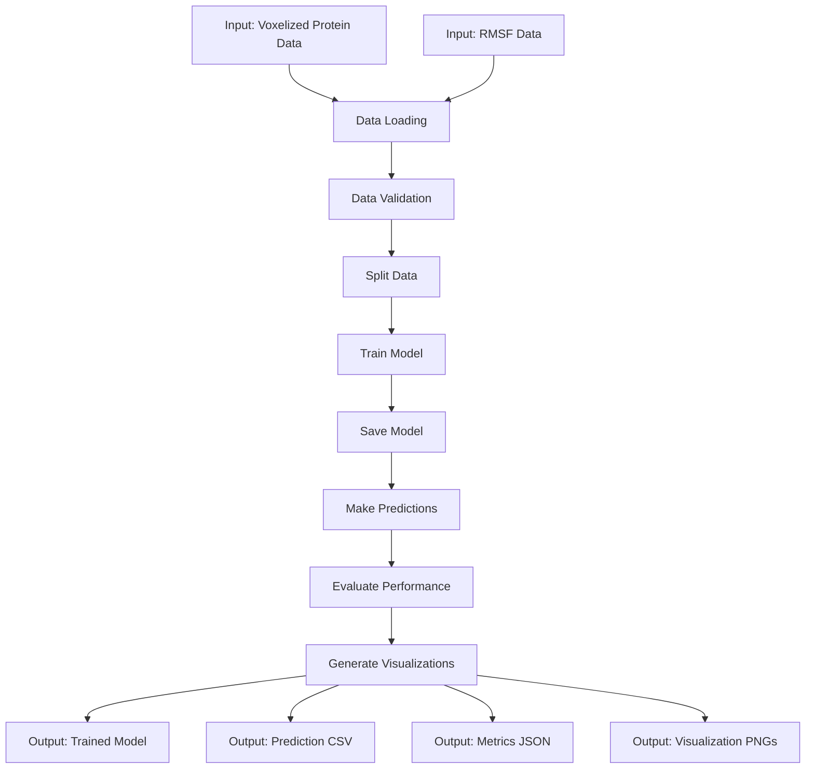
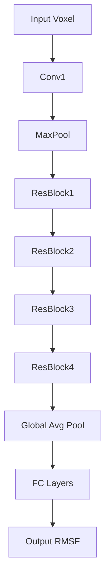

# 🧬 VoxelFlex: Protein RMSF Prediction from Voxelized Data

<img src="

[](https://www.python.org/)
[](https://pytorch.org/)
[](https://opensource.org/licenses/MIT)

## 📋 Overview

**VoxelFlex** is a powerful machine learning package for predicting per-residue Root Mean Square Fluctuation (RMSF) values from voxelized protein data. RMSF is a crucial metric for understanding protein dynamics and flexibility, providing insights into functional mechanisms.

This package implements a complete machine learning pipeline using 3D Convolutional Neural Networks (CNNs) to process voxelized structural data (in HDF5 format) and predict RMSF values with high accuracy.

### ✨ Key Features

- 🧠 Multiple 3D CNN architectures (VoxelFlexCNN, DilatedResNet3D, MultipathRMSFNet)
- 📊 Comprehensive evaluation metrics and visualizations
- 🛠️ Unified CLI interface for the entire ML pipeline
- ⚙️ Highly configurable via YAML configuration files
- 🔍 Robust validation and error handling
- 📈 Detailed logging and progress tracking
- 🖥️ Automatic GPU detection and utilization

## 🚀 Installation

### Prerequisites

- Python 3.8+
- CUDA-compatible GPU (recommended but not required)

### Creating a Conda Environment

```bash
# Create a new conda environment
conda create -n voxelflex python=3.10
conda activate voxelflex

# Install PyTorch with CUDA support (adjust based on your CUDA version)
conda install pytorch torchvision torchaudio pytorch-cuda=11.8 -c pytorch -c nvidia
```

### Installing VoxelFlex

```bash
# Clone the repository

cd voxelflex

# Install the package in development mode
pip install -e .
```

## 🔧 Usage

VoxelFlex provides a unified command-line interface with several commands:

```bash
# Display help information
voxelflex -h
```

### Running the Complete Pipeline

```bash
# Run the entire pipeline: train, predict, evaluate, visualize
voxelflex run --config path/to/config.yaml
```

### Individual Commands

```bash
# Train a model
voxelflex train --config path/to/config.yaml

# Make predictions with a trained model
voxelflex predict --config path/to/config.yaml --model path/to/model.pt

# Evaluate model performance
voxelflex evaluate --config path/to/config.yaml --model path/to/model.pt

# Create visualizations from predictions
voxelflex visualize --config path/to/config.yaml --predictions path/to/predictions.csv
```

## 📂 Project Structure

```
voxelflex/
├── main.py                # Entry point for package
├── setup.py               # Package installation script
├── requirements.txt       # Package dependencies
├── README.md              # This file
└── src/                   # Source code directory
    └── voxelflex/         # Main package
        ├── __init__.py
        ├── main.py
        ├── cli/           # Command-line interface
        │   ├── __init__.py
        │   ├── cli.py     # CLI entry point
        │   └── commands/  # Command implementations
        ├── config/        # Configuration handling
        │   ├── __init__.py
        │   ├── config.py
        │   └── default_config.yaml
        ├── data/          # Data loading and processing
        │   ├── __init__.py
        │   ├── data_loader.py
        │   └── validators.py
        ├── models/        # Neural network models
        │   ├── __init__.py
        │   └── cnn_models.py
        ├── utils/         # Utility functions
        │   ├── __init__.py
        │   ├── file_utils.py
        │   ├── logging_utils.py
        │   └── system_utils.py
        └── visualization/ # Visualization utilities
            ├── __init__.py
            └── visualization.py
```

## 🔄 Workflow Description



### Inputs and Outputs

| Input | Description | Format |
|-------|-------------|--------|
| Voxelized Protein Data | 3D voxelized representation of protein structures | HDF5 (.hdf5) |
| RMSF Data | Per-residue RMSF values for proteins | CSV (.csv) |

| Output | Description | Format |
|--------|-------------|--------|
| Trained Model | Saved neural network model | PyTorch (.pt) |
| Predictions | Per-residue RMSF predictions | CSV (.csv) |
| Metrics | Performance metrics (RMSE, MAE, R²) | JSON (.json) |
| Visualizations | Plots of model performance and predictions | PNG (.png) |

## ⚙️ Configuration File

VoxelFlex uses YAML configuration files to control all aspects of the pipeline. Here's an explanation of the main sections:

### Input Configuration

```yaml
input:
  data_dir: /path/to/data                       # Base directory for all data files
  voxel_file: /path/to/voxelized_output.hdf5    # Full path to the voxel data
  rmsf_dir: /path/to/rmsf/data                  # Full path to RMSF data directory
  temperature: 320                              # Temperature identifier: 320, 348, 379, 413, 450, or "average"
  domain_ids: [1a02F00]                         # List of domain IDs to process
  use_metadata: true                            # Flag to include metadata in processing
```

### Output Configuration

```yaml
output:
  base_dir: outputs/                            # Base output directory
  log_file: voxelflex.log                       # Filename for logging output
```

### Model Configuration

```yaml
model:
  architecture: voxelflex_cnn                   # Choose from: voxelflex_cnn, dilated_resnet3d, multipath_rmsf_net
  input_channels: 5                             # Number of channels: 5 (C, N, O, CA, CB) or 4 if CA/CB are missing
  channel_growth_rate: 1.5                      # Growth rate for channels in the model
  num_residual_blocks: 4                        # Number of residual blocks in the CNN
  dropout_rate: 0.3                             # Dropout rate for regularization
  base_filters: 32                              # Base number of filters for convolutional layers
```

### Training Configuration

```yaml
training:
  batch_size: 32                                # Training batch size
  num_epochs: 5                                 # Number of training epochs
  learning_rate: 0.001                          # Learning rate for optimizer
  weight_decay: 1e-5                            # Weight decay for regularization
  train_split: 0.7                              # Proportion of data for training
  val_split: 0.15                               # Proportion of data for validation
  test_split: 0.15                              # Proportion of data for testing
  seed: 42                                      # Random seed for reproducibility
  scheduler:                                    # Learning rate scheduler configuration
    type: reduce_on_plateau                     # Scheduler type: reduce_on_plateau or step
    patience: 10                                # Patience for ReduceLROnPlateau
    factor: 0.1                                 # Factor for scheduler
    mode: min                                   # Mode for ReduceLROnPlateau: min or max
```

### Logging and Visualization Configuration

```yaml
logging:
  level: INFO                                   # Overall logging level
  console_level: INFO                           # Logging level for console output
  file_level: DEBUG                             # Logging level for file output
  show_progress_bars: true                      # Display progress bars during processing

visualization:
  plot_loss: true                               # Plot training loss over epochs
  plot_predictions: true                        # Plot predicted vs. actual RMSF values
  plot_residue_type_analysis: true              # Analyze prediction errors across residue types
  plot_error_distribution: true                 # Visualize overall error distribution
  plot_amino_acid_performance: true             # Generate histogram of prediction errors across amino acids
  save_format: png                              # Format for saving visualizations
  dpi: 300                                      # DPI for saved figures
  plot_correlation: true                        # Plot correlation between predictions and ground truth
  max_scatter_points: 1000                      # Maximum scatter points in plots
```

### System Utilization Configuration

```yaml
system_utilization:
  detect_cores: true                            # Enable detection of CPU cores for multiprocessing
  adjust_for_gpu: true                          # Adjust processing based on GPU availability
  num_workers: 10                               # Number of worker processes for DataLoaders
```

## 🧩 Code Explanation

### Data Loading and Validation

VoxelFlex implements robust data loading and validation to ensure data consistency:

- `data_loader.py`: Handles loading voxelized protein data from HDF5 files and RMSF data from CSV files
- `validators.py`: Ensures data consistency, handles missing values, and validates mappings between domains and residues

### Model Architectures

Three different 3D CNN architectures are implemented to predict RMSF values:

1. **VoxelFlexCNN**: Basic 3D CNN with convolutional and fully connected layers
2. **DilatedResNet3D**: Uses dilated convolutions in residual blocks for better multi-scale feature capture
3. **MultipathRMSFNet**: Multi-path architecture with parallel branches using different kernel sizes



### Training Pipeline

The training pipeline:
1. Loads and validates the data
2. Splits data into training, validation, and test sets
3. Trains the model using the specified architecture
4. Monitors validation loss for early stopping or learning rate adjustment
5. Saves the trained model and training history

### Evaluation and Visualization

VoxelFlex provides comprehensive evaluation metrics and visualizations:

- Overall metrics: MSE, RMSE, MAE, and R²
- Domain-specific metrics
- Residue type-specific metrics
- Visualizations:
  - Training/validation loss curves
  - Prediction scatter plots
  - Error distributions
  - Residue-specific performance analysis
  - Amino acid performance comparison

## 📊 Visualization Examples

Here are some examples of the visualizations generated by VoxelFlex:

### Loss Curve


### Prediction Scatter Plot


### Error Distribution


### Residue Type Analysis


## 🤝 Contributing

Contributions are welcome! Please feel free to submit a Pull Request.

## 📄 License

This project is licensed under the MIT License - see the LICENSE file for details.

## 📚 Citation

If you use VoxelFlex in your research, please cite:

```
@software{voxelflex2025,
  author = {Felix, S.},
  title = {VoxelFlex: A Machine Learning Package for Predicting Protein RMSF from Voxelized Data},
  year = {2025},
  url = {
}
```

## 🙏 Acknowledgments

- Thanks to all contributors who have helped make this project possible
- Special thanks to the PyTorch team for their incredible deep learning framework
