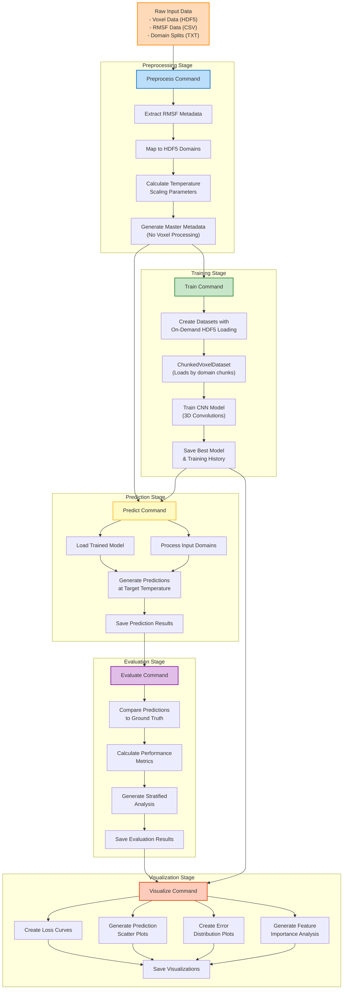

# VoxelFlex: Temperature-Aware Protein Flexibility Prediction 🧬🧠

<div align="center">


[](https://www.python.org/)
[](https://pytorch.org/)
[](LICENSE)
[](CONTRIBUTING.md)

**A deep learning pipeline for predicting temperature-dependent protein flexibility (RMSF) from 3D voxel representations using Convolutional Neural Networks.**

[🔑 Key Features](#-key-features) •
[🔧 Installation](#-installation) •
[🚀 Quick Start](#-quick-start) •
[🔄 Pipeline Overview](#-pipeline-overview) •
[📥 Input Data](#-input-data) •
[📤 Output Data](#-output-data) •
[🧠 Models](#-models) •
[⚙️ Configuration](#-configuration) •
[💻 Command-Line Interface](#-command-line-interface) •
[📚 Documentation](#-documentation)

</div>

## 🌟 Overview

VoxelFlex is a robust and efficient Python package designed to predict per-residue protein flexibility (measured as Root Mean Square Fluctuation, RMSF) from 3D structural voxel representations while incorporating temperature awareness. The model learns to predict RMSF values at arbitrary input temperatures, enabling better understanding of protein dynamics across thermal conditions.

VoxelFlex employs a unique two-stage approach to handle potentially very large voxel datasets efficiently:

1. **Metadata Preprocessing**: Generates a compact metadata manifest without storing intermediate voxel data.
2. **On-Demand HDF5 Loading**: Reads voxel data directly from the source HDF5 file during training, avoiding excessive memory usage.

This design enables training on massive protein datasets even with limited computational resources.

## 🔑 Key Features

<table>
<thead>
  <tr bgcolor="#6236FF">
    <th width="200"><span style="color:white">Feature</span></th>
    <th><span style="color:white">Description</span></th>
  </tr>
</thead>
<tbody>
  <tr>
    <td>🌡️ <b>Temperature Awareness</b></td>
    <td>Predicts protein flexibility at arbitrary temperatures, learning temperature-dependent dynamics from training data.</td>
  </tr>
  <tr>
    <td>🧊 <b>3D Voxel Processing</b></td>
    <td>Processes 3D voxelized representations of protein structures, capturing spatial relationships between atoms.</td>
  </tr>
  <tr>
    <td>🧠 <b>Deep Learning Models</b></td>
    <td>Implements multiple 3D CNN architectures (DenseNet3D, DilatedResNet3D, MultipathRMSFNet) specifically designed for voxel data.</td>
  </tr>
  <tr>
    <td>📊 <b>Memory-Efficient Pipeline</b></td>
    <td>Two-stage approach with metadata preprocessing and on-demand HDF5 loading, avoiding storage of large intermediate tensors.</td>
  </tr>
  <tr>
    <td>⚡ <b>Performance Optimization</b></td>
    <td>Supports mixed-precision training, gradient accumulation, and advanced optimization strategies to handle large datasets.</td>
  </tr>
  <tr>
    <td>📈 <b>Comprehensive Evaluation</b></td>
    <td>Detailed evaluation metrics including stratified analysis by secondary structure, solvent accessibility, and temperature.</td>
  </tr>
  <tr>
    <td>📊 <b>Visualization Tools</b></td>
    <td>Generates training curves, prediction visualizations, and residue-specific analysis to interpret model performance.</td>
  </tr>
  <tr>
    <td>🔄 <b>Modular Design</b></td>
    <td>Well-structured codebase for easy extension or modification of models, data processing, and evaluation.</td>
  </tr>
  <tr>
    <td>💻 <b>Command-Line Interface</b></td>
    <td>User-friendly CLI with commands for preprocessing, training, prediction, evaluation, and visualization.</td>
  </tr>
</tbody>
</table>

## 🔧 Installation

### Prerequisites
- Python 3.9+
- CUDA-capable GPU (recommended)
- HDF5 libraries

### Install from Source
```bash
# Clone the repository
git clone https://github.com/your-username/voxelflex.git
cd voxelflex

# Create a virtual environment (recommended)
python -m venv venv
source venv/bin/activate  # On Windows: venv\Scripts\activate

# Install the package in development mode
pip install -e .

# Install dependencies
pip install -r requirements.txt
```

### Verify Installation
```bash
# Verify that CLI commands are available
voxelflex --help
```

## 🚀 Quick Start

VoxelFlex follows a pipeline workflow with distinct stages: preprocess, train, predict, evaluate, and visualize.

### 1. Configure Your Project
Start by creating a configuration file or using the default configuration:

```bash
# Copy the default configuration file
cp src/voxelflex/config/default_config.yaml my_config.yaml
```

Edit `my_config.yaml` to specify your input data paths, output directories, and model settings.

### 2. Preprocess the Dataset
The preprocessing step extracts metadata from RMSF data and does not process voxel tensors:

```bash
voxelflex preprocess --config my_config.yaml
```

This will:
- Generate a metadata manifest file (`master_samples.parquet`)
- Calculate temperature scaling parameters
- Identify domains that couldn't be processed

### 3. Train the Model
Train a model using the preprocessed metadata:

```bash
voxelflex train --config my_config.yaml
```

This will:
- Load data using the chunked processing approach
- Train the specified model architecture
- Save model checkpoints
- Output training metrics and curves

### 4. Make Predictions
Predict RMSF values for a specific set of domains at a target temperature:

```bash
voxelflex predict --config my_config.yaml --model ./models/best_model.pt --temperature 348 --domains 1abcA00 1xyzB00
```

### 5. Evaluate Model Performance
Evaluate model predictions against ground truth:

```bash
voxelflex evaluate --config my_config.yaml --model ./models/best_model.pt --predictions ./outputs/predictions.csv
```

### 6. Generate Visualizations
Create visualizations to analyze model performance:

```bash
voxelflex visualize --config my_config.yaml --predictions ./outputs/predictions.csv --history ./outputs/training_history.json
```

## 🔄 Pipeline Overview

The VoxelFlex pipeline implements a memory-efficient workflow for processing large voxel datasets:



## 📥 Input Data

VoxelFlex expects three main types of input data:

### 1. Voxel Data (HDF5)
```
Format: HDF5 (.hdf5)
Structure: DomainID -> ChainID -> ResidueID -> HDF5 Dataset
Expected voxel shape: (21, 21, 21, 5) with boolean values
```

The HDF5 file contains voxelized representations of protein structures, where each residue is represented as a 3D grid with 5 channels.

### 2. RMSF Data (CSV)
```
Required columns:
- domain_id: Protein domain identifier
- resid: Residue ID (integer)
- resname: Residue name (string)
- temperature_feature: Temperature in Kelvin (float)
- target_rmsf: RMSF value (float)

Optional columns:
- relative_accessibility: Solvent accessibility (used for evaluation)
- dssp: Secondary structure assignment (used for evaluation)
- secondary_structure_encoded: Numerical encoding of secondary structure
```

This file contains RMSF values for protein residues across multiple temperatures.

### 3. Domain Split Files (TXT)
```
Format: Plain text (.txt)
Content: One HDF5 domain ID per line
Required files:
- Train split
- Validation split
- Test split (optional)
```

These files define which domains should be used for training, validation, and testing.

## 📤 Output Data

VoxelFlex generates the following outputs:

### Preprocessing Outputs
```
- input_data/processed/master_samples.parquet: Metadata manifest file
- outputs/<run_name>/models/temp_scaling_params.json: Temperature scaling parameters
- outputs/<run_name>/failed_preprocess_domains.txt: List of domains skipped during preprocessing
```

### Training Outputs
```
- outputs/<run_name>/models/best_model.pt: Best model checkpoint
- outputs/<run_name>/models/latest_model.pt: Latest model checkpoint
- outputs/<run_name>/models/checkpoint_epoch_*.pt: Periodic checkpoints (optional)
- outputs/<run_name>/training_history.json: Training metrics history
- outputs/<run_name>/logs/voxelflex.log: Detailed log file
```

### Prediction Outputs
```
- outputs/<run_name>/metrics/predictions_*.csv: CSV file with predicted RMSF values
```

### Evaluation Outputs
```
- outputs/<run_name>/metrics/evaluation_metrics_*.json: Performance metrics
```

### Visualization Outputs
```
- outputs/<run_name>/visualizations/*.png: Generated plots
- outputs/<run_name>/visualizations/*_data.csv: Data used for plots (optional)
```

## 🧠 Models

VoxelFlex includes several 3D CNN model architectures for voxel data processing:

### MultipathRMSFNet
The default model with multiple parallel paths for multi-scale feature extraction:
```
- Multiple parallel convolutional paths with different kernel sizes (3, 5, 7)
- Feature fusion through concatenation and 1x1 convolution
- Temperature feature integration at the regression head
```

### DenseNet3D
DenseNet architecture adapted for 3D voxel data:
```
- Dense connectivity pattern for feature reuse
- Configurable growth rate and block structure
- Efficient parameter utilization through bottleneck layers
```

### DilatedResNet3D
ResNet architecture with dilated convolutions for increased receptive field:
```
- Residual connections for gradient flow
- Growing dilation pattern for efficient receptive field expansion
- Reduced parameter count compared to standard 3D CNNs
```

All models integrate temperature as an explicit input feature, enabling predictions at arbitrary temperatures.

## ⚙️ Configuration

VoxelFlex is highly configurable through a YAML configuration file. Here are the key configuration sections:

### Input/Output Configuration
```yaml
input:
  voxel_file: input_data/voxel/mdcath_voxelized.hdf5
  aggregated_rmsf_file: input_data/rmsf/aggregated_rmsf_all_temps.csv
  train_split_file: input_data/train_domains.txt
  val_split_file: input_data/val_domains.txt
  test_split_file: input_data/test_domains.txt
  max_domains: null  # Set to null or remove if no limit desired

data:
  processed_dir: input_data/processed/
  master_samples_file: "master_samples.parquet"
  temp_scaling_params_file: "temp_scaling_params.json"

output:
  base_dir: outputs/
  run_name: "voxelflex_run_{timestamp}"
  log_file: voxelflex.log
```

### Model Configuration
```yaml
model:
  architecture: multipath_rmsf_net  # Options: multipath_rmsf_net, densenet3d_regression, dilated_resnet3d
  input_channels: 5
  voxel_depth: 21
  voxel_height: 21
  voxel_width: 21
  
  # Architecture-specific parameters
  densenet:
    growth_rate: 16
    block_config: [4, 4, 4]
    num_init_features: 32
    bn_size: 4
    
  # Common parameters
  channel_growth_rate: 1.5
  num_residual_blocks: 3
  base_filters: 32
  dropout_rate: 0.3
```

### Training Configuration
```yaml
training:
  # Chunked data loading
  chunk_size: 100  # Number of domains per chunk
  
  # Training parameters
  batch_size: 256
  num_epochs: 100
  learning_rate: 0.0005
  weight_decay: 1e-4
  seed: 42
  num_workers: 2
  
  # Mixed precision
  mixed_precision:
    enabled: true
    
  # Learning rate scheduler
  scheduler:
    type: reduce_on_plateau
    monitor_metric: "val_pearson"
    mode: "max"
    patience: 5
    factor: 0.5
    
  # Early stopping
  early_stopping:
    enabled: true
    patience: 10
    monitor_metric: "val_pearson"
    mode: "max"
```

### Evaluation Configuration
```yaml
evaluation:
  calculate_stratified_metrics: true
  calculate_permutation_importance: true
  sasa_bins: [0.0, 0.1, 0.4, 1.01]
  permutation_n_repeats: 5
```

### Visualization Configuration
```yaml
visualization:
  plot_loss: true
  plot_correlation: true
  plot_predictions: true
  plot_density_scatter: true
  plot_error_distribution: true
  plot_residue_type_analysis: true
  plot_sasa_error_analysis: true
  plot_ss_error_analysis: true
  save_format: png
  dpi: 150
  max_scatter_points: 1000
  save_plot_data: true
```

## 💻 Command-Line Interface

VoxelFlex provides a comprehensive command-line interface:

```
voxelflex <command> [options]
```

### Available Commands

#### `preprocess`
Process metadata from RMSF data and generate mapping to voxel data:
```bash
voxelflex preprocess --config path/to/config.yaml [-v|-vv]
```

#### `train`
Train a model using preprocessed data:
```bash
voxelflex train --config path/to/config.yaml [--force_preprocess] [--subset FLOAT]
```

#### `predict`
Generate predictions for specific domains at a target temperature:
```bash
voxelflex predict --config path/to/config.yaml --model path/to/model.pt --temperature 320 [--domains ID1 ID2 ...] [--output_csv filename.csv]
```

#### `evaluate`
Evaluate model performance against ground truth:
```bash
voxelflex evaluate --config path/to/config.yaml --model path/to/model.pt --predictions path/to/preds.csv
```

#### `visualize`
Generate visualizations from prediction and training data:
```bash
voxelflex visualize --config path/to/config.yaml --predictions path/to/preds.csv [--history path/to/history.json]
```

### Common Options
- `-v`, `--verbose`: Increase verbosity (INFO level)
- `-vv`: Debug level logging
- `--config`: Path to configuration YAML file
- `--force_preprocess`: Run preprocessing before training
- `--subset`: Use a subset of training data (0.0-1.0)

## 📚 Documentation

### Project Structure
```
voxelflex/
├── src/
│   └── voxelflex/
│       ├── __init__.py
│       ├── cli/               # Command-line interface
│       │   ├── cli.py         # Main CLI entry point
│       │   └── commands/      # Command implementations
│       ├── config/            # Configuration handling
│       │   ├── config.py
│       │   └── default_config.yaml
│       ├── data/              # Data loading and processing
│       │   ├── data_loader.py # ChunkedVoxelDataset implementation
│       │   └── validators.py  # Input data validation
│       ├── models/            # Model implementations
│       │   └── cnn_models.py  # CNN architectures
│       └── utils/             # Utility functions
│           ├── file_utils.py
│           ├── logging_utils.py
│           ├── system_utils.py
│           └── temp_scaling.py
├── input_data/                # Input data directory
│   ├── processed/             # Preprocessed data
│   ├── rmsf/                  # RMSF data files
│   ├── test_domains.txt       # Test split
│   ├── train_domains.txt      # Train split
│   ├── val_domains.txt        # Validation split
│   └── voxel/                 # Voxel data
├── outputs/                   # Generated outputs
│   └── <run_name>/            # Run-specific outputs
├── models/                    # Saved models
│   └── <run_name>/            # Run-specific models
├── LICENSE
├── README.md
├── pyproject.toml
├── requirements.txt
└── setup.py
```

### Detailed Documentation
For more detailed documentation on individual modules and functions, please refer to the docstrings in the source code.

## 📄 License

This project is licensed under the MIT License - see the LICENSE file for details.

## 👏 Acknowledgements

- Developed by Felix Burton
- Utilizes numerous open-source libraries including PyTorch, H5py, Pandas, NumPy, and scikit-learn
- Special thanks to all contributors and researchers advancing the field of protein dynamics prediction

---

<p align="center">
<i>VoxelFlex: Understanding protein flexibility across temperatures using 3D voxel representations.</i>
</p>